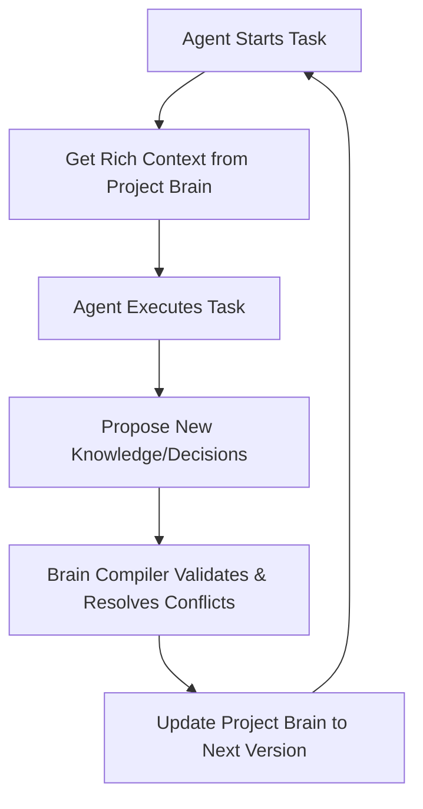

<div align="center">
  
  <h1>AgentHelm</h1>
  <p><strong>The Context and Governance Platform for Autonomous AI Agent Fleets</strong></p>

  <p>
    <a href="https://pypi.org/project/agenthelm-sdk"></a>
    <a href="https://www.npmjs.com/package/agenthelm-node-sdk"></a>
    <a href="https://github.com/jayasukuv11-beep/agenthelm/blob/main/LICENSE"></a>
    <a href="https://agenthelm.online"></a>
  </p>
</div>

---

## 🧠 The Project Brain Loop

AgentHelm focuses on agent context, governance, and behavior. At its core is the **Project Brain Loop**:



1. **Get Context**: When an agent spins up, it receives versioned, indexed context directly from the shared **Project Brain**.
2. **Execute Tasks**: The agent operates within safety constraints, using real-time observability, cost controls, and Telegram HITL safeguards.
3. **Propose Knowledge**: As the agent learns or makes design decisions, it proposes knowledge updates.
4. **Compile & Evolve**: The **Brain Compiler** checks for conflicts, validates evidence, and merges changes into a new, versioned release of the Project Brain.
5. **Next Agent Iteration**: The next agent gets a more accurate, updated context base.

---

## 🏗️ Key Pillars

- **🧠 Project Brain & Compiler**: A versioned, queryable knowledge repository built directly from agent execution. Enforces constraints and resolves schema/decision conflicts.
- **🔭 Absolute Observability**: Real-time log streaming, token tracing, and agent activity logs.
- **🛡️ Human-in-the-Loop (HITL)**: One-click Telegram approvals for irreversible actions (deletes, payments, transfers).
- **📉 Cost & Quality Safeguards**: Hard limits on token budgets, evidence-backed confidence scoring, and automated secret stripping.
- **⏸️ Remote Control**: Pause, stop, or override agent state dynamically from the dashboard.

---

## 🚀 Quick Start (v1.0.0)

### Python
```bash
pip install agenthelm-sdk
```
```python
from agenthelm import Agent

# Connect to the control plane and fetch project brain context
agent = Agent(key="ahe_live_...", name="Market Researcher", project="AgentHelm Platform")

# Request context relevant to database schema
context = agent.get_context(category="database")
print("Context entries:", context.entries)

# Propose new knowledge to the Brain Compiler
agent.propose_knowledge(
    summary="Migrate authentication from JWT to Session Cookies",
    decisions=["Use session IDs mapped to Redis backend"],
    files_modified=["lib/auth.ts", "middleware.ts"],
    confidence=95
)
```

### Node.js
```bash
npm install agenthelm-node-sdk
```
```javascript
import { Agent } from 'agenthelm-node-sdk';

const agent = new Agent({ 
  key: 'ahe_live_...', 
  name: 'Support Bot',
  project: 'AgentHelm Platform' 
});

agent.log('Analyzing sentiment...', 'info');
agent.output({ score: 0.92 }, 'sentiment_results');
```

---

## 📲 The Safety Bridge (Telegram)

AgentHelm bridges the gap between your server and your pocket. When an agent hits a method decorated with `@irreversible`, you receive a rich alert on Telegram:

> **⚠️ Irreversible Action Requested**  
> **Agent:** `Cloud Architect`  
> **Action:** `destroy_infrastructure`  
> **Payload:** `{"region": "us-east-1"}`  
>   
> [ ✅ Approve ]   [ ❌ Reject ]

---

## 📊 Dashboard

The **Industrial Signal Orange** dashboard provides a high-fidelity view of your entire agent fleet, Project Brain health metrics, and compiler timeline. Track evolution, resolve conflicts, and audit every execution step.

Visit **[agenthelm.online](https://agenthelm.online)** to get started.

---

## 🛠️ Tech Stack
- **Dashboard**: Next.js, TailwindCSS (Industrial Theme), Supabase, Shadcn/UI.
- **SDKs**: Python (twine), Node.js (TypeScript).
- **Control**: Telegram Bot API, Edge Functions.

## ⚖️ License
MIT © [AgentHelm Team](https://agenthelm.online)
