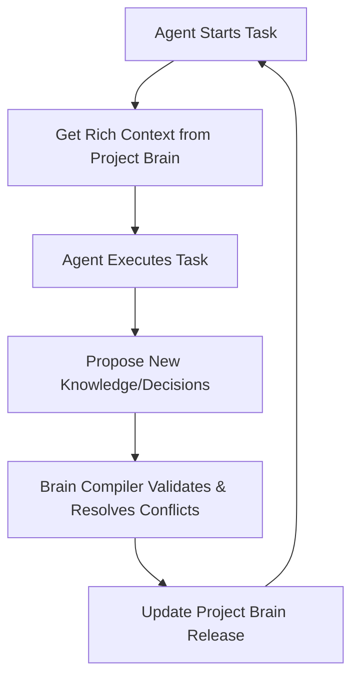

<div align="center">
  
  <h1>AgentHelm</h1>
  <p><strong>Shared Memory and Governance Control Plane for Autonomous AI Agent Fleets</strong></p>

  <p>
    <a href="https://pypi.org/project/agenthelm-sdk"></a>
    <a href="https://www.npmjs.com/package/agenthelm-node-sdk"></a>
    <a href="https://www.npmjs.com/package/agenthelm-mcp"></a>
    <a href="https://github.com/jayasukuv11-beep/agenthelm/blob/main/LICENSE"></a>
    <a href="https://agenthelm.online"></a>
  </p>
</div>

---

> **AgentHelm** gives AI coding agents (Claude Code, Cursor, Windsurf, custom Python/Node fleets) a shared, versioned **Project Brain**. Agents remember architecture, API conventions, schemas, and trade-offs across sessions instead of starting from zero.

---

## 🧠 The Project Brain Loop



1. **Get Context**: On startup, an agent fetches versioned, compiled architecture & database context.
2. **Execute Safely**: Agent operates within token budgets and Telegram HITL safety guardrails.
3. **Propose Knowledge**: As agents discover schemas or make design trade-offs, they propose knowledge entries.
4. **Compile & Evolve**: The **Brain Compiler** verifies evidence, resolves conflicts, and releases the next Project Brain version.

---

## ⚡ 60-Second Setup: Model Context Protocol (MCP)

Plug AgentHelm directly into **Cursor**, **Claude Code**, or **Claude Desktop**:

### Add to `.cursor/mcp.json` or `claude_desktop_config.json`

```json
{
  "mcpServers": {
    "agenthelm": {
      "command": "npx",
      "args": ["-y", "agenthelm-mcp"],
      "env": {
        "AGENTHELM_CONNECT_KEY": "ahe_live_YOUR_KEY_HERE",
        "AGENTHELM_PROJECT": "your-project-name"
      }
    }
  }
}
```

### Exposed MCP Tools
- **`get_context`**: Query versioned project architecture, database schemas, and conventions.
- **`propose_knowledge`**: Propose new engineering decisions and codebase discoveries.
- **`get_history`**: Audit version history logs, diffs, and decision trace blame.

---

## 🚀 Programmatic SDKs

### Python SDK
```bash
pip install agenthelm-sdk
```
```python
from agenthelm import Agent

# Connect to control plane and fetch project brain context
agent = Agent(key="ahe_live_...", name="Architect Agent", project="My App")

# Get context for database schema
context = agent.get_context(category="database")
print("Project Context:", context.entries)

# Propose new knowledge to the Brain Compiler
agent.propose_knowledge(
    summary="Migrate authentication from JWT to Session Cookies",
    decisions=["Use session IDs mapped to Redis backend"],
    files_modified=["lib/auth.ts", "middleware.ts"],
    confidence=95
)
```

### Node.js SDK
```bash
npm install agenthelm-node-sdk
```
```typescript
import { Agent } from 'agenthelm-node-sdk';

const agent = new Agent({ 
  key: 'ahe_live_...', 
  name: 'Support Bot',
  project: 'My App' 
});

agent.log('Analyzing sentiment...', 'info');
agent.output({ score: 0.92 }, 'sentiment_results');
```

---

## 📲 Human-in-the-Loop (HITL) Safety Gate

AgentHelm prevents autonomous catastrophic actions. Mark functions as `@irreversible` to trigger inline Telegram approval gates:

> **⚠️ Irreversible Action Requested**  
> **Agent:** `Cloud Architect`  
> **Action:** `destroy_infrastructure`  
> **Payload:** `{"region": "us-east-1"}`  
>   
> [ ✅ Approve ]   [ ❌ Reject ]

---

## 🏗️ Key Architecture Pillars

- **🧠 Brain Compiler**: Versioned knowledge engine resolving schema and architectural decision conflicts.
- **🔭 Fleet Observability**: Real-time telemetry, token cost tracking, and execution tracing.
- **🛡️ Safety Firewall**: Classification decorators (`@read`, `@side_effect`, `@irreversible`) with fail-closed default safety.
- **⏸️ Remote Mission Control**: Pause, resume, or override agent state directly from [agenthelm.online](https://agenthelm.online).

---

## 🌐 Dashboard & Community

- **Web Dashboard**: [https://agenthelm.online](https://agenthelm.online)
- **Documentation**: [agenthelm.online/docs](https://agenthelm.online/docs)
- **Issues & Support**: [GitHub Issues](https://github.com/jayasukuv11-beep/agenthelm/issues)

---

## ⚖️ License
MIT © [AgentHelm Team](https://agenthelm.online)
